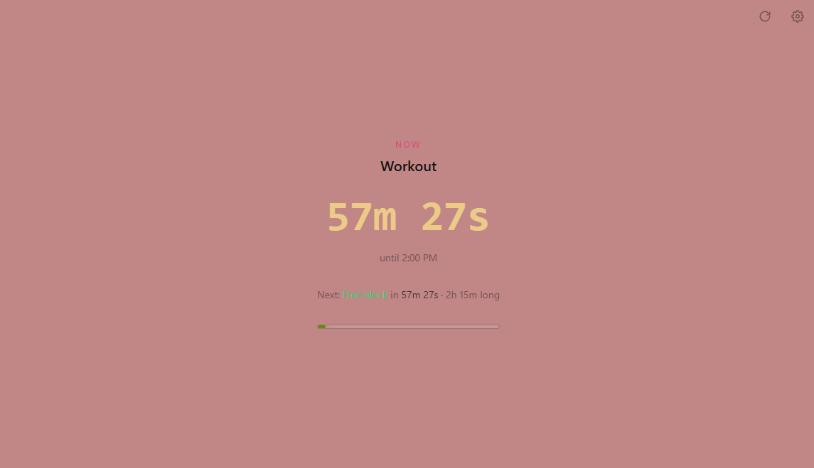
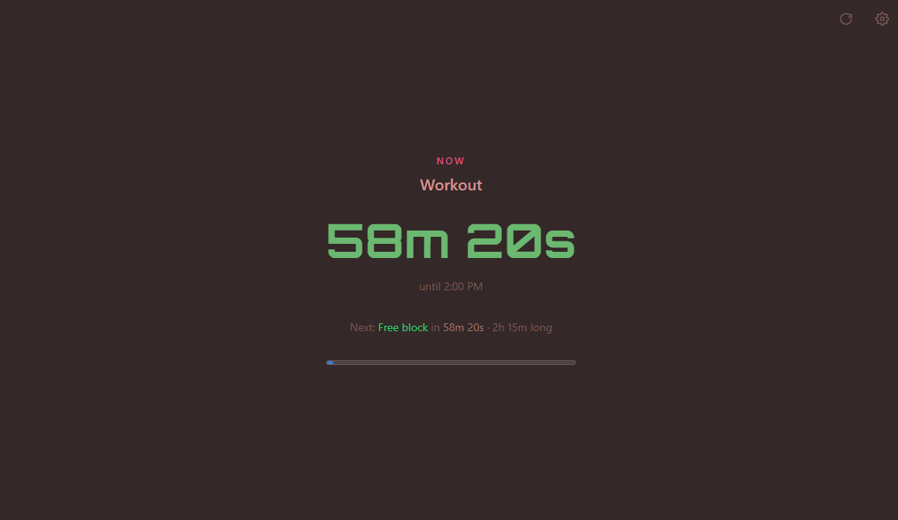

# tiimeo

A minimal, mobile-first countdown for your day. It reads your Google Calendar
and shows what's happening **now**, how long it has left, and what's **next**.

<table>
<tr>
<td width="50%"></td>
<td width="50%"></td>
</tr>
</table>

Two of the countless looks possible with the **Custom** theme — every color
(background, text, bar, clock) and the font are independently configurable
in Settings.

Runs entirely client-side — no backend, no database. Sign-in uses Google's
own OAuth widget, the access token lives only in this browser tab
(`sessionStorage`), and calendar data is fetched straight from Google's API
and never sent anywhere else. That keeps it free to host and keeps your data
out of any server you don't control.

## Features

- Live countdown to the end of your current event, and to the start of the next
- Free-time blocks called out between events
- Notifications, sound, and vibration alerts a configurable number of minutes before each event
- Fully themeable: 6 built-in themes, or a **Custom** theme with your own
  background, text, bar, and clock colors, plus 3 progress-bar styles
  (solid / glow / minimal) and 8 fonts
- Installable as a home-screen app (PWA) on iOS and Android

## Setup

### 1. Create a free Google OAuth client

1. Go to the [Google Cloud Console](https://console.cloud.google.com/) and
   create a project (free).
2. **APIs & Services → Library** → enable the **Google Calendar API**.
3. **APIs & Services → OAuth consent screen**:
   - User type: **External** (or Internal on Workspace).
   - Fill in the required app name / support email.
   - Add yourself as a **test user**. This keeps the app in "Testing" mode —
     free forever, no verification needed, as long as it's just you.
4. **APIs & Services → Credentials → Create Credentials → OAuth client ID**:
   - Application type: **Web application**.
   - **Authorized JavaScript origins**: add `http://localhost:3000` for
     local dev, plus your deployed URL once you have one.
   - No redirect URI needed — this app uses the token flow.
5. Copy the generated **Client ID** (`123456-abc.apps.googleusercontent.com`).

### 2. Configure and run

```bash
cp .env.local.example .env.local
# paste your client ID into .env.local:
# NEXT_PUBLIC_GOOGLE_CLIENT_ID=your-client-id.apps.googleusercontent.com

npm install
npm run dev
```

Open <http://localhost:3000>, sign in, and grant read-only calendar access.

### 3. Deploy for free (Vercel)

1. Push this repo to GitHub and import it at [vercel.com/new](https://vercel.com/new).
2. Add the `NEXT_PUBLIC_GOOGLE_CLIENT_ID` environment variable in the
   project settings.
3. Add the deployed URL to **Authorized JavaScript origins** on your Google
   OAuth client.
4. On your phone, open the site and use "Add to Home Screen" for an app-like
   icon and standalone window.

## How it works

| Concern | File |
|---|---|
| OAuth sign-in (browser-only token flow) | `src/lib/google-auth.ts`, `src/hooks/useGoogleAuth.ts` |
| Calendar sync (polls every 3 min + on focus) | `src/lib/calendar-api.ts`, `src/hooks/useCalendarEvents.ts` |
| Current/next/free-block derivation | `src/lib/schedule.ts` |
| Live clock tick | `src/hooks/useNow.ts` |
| Theming (presets + custom colors) | `src/lib/settings.ts`, `src/hooks/useTheme.ts`, `src/app/globals.css` |
| Calendar color assignment | `src/lib/palette.ts` |
| Alerts (notification/sound/vibration) | `src/hooks/useEventAlerts.ts`, `src/lib/notifications.ts`, `src/lib/sound.ts` |

Themes work as CSS custom properties on `<html>`. Each built-in theme sets a
background, text, and accent color in `globals.css`; the bar and clock
colors default to those but are independent variables, so a theme (or the
custom color pickers in Settings) can override them on their own. Calendar
category colors (`--series-*`) are intentionally fixed across all themes, so
an event's color never shifts on you.

## Project structure

```
src/
  app/          Next.js routes: layout, page, manifest, generated icons
  components/   UI: sign-in, countdown display, settings panel
  hooks/        useGoogleAuth, useCalendarEvents, useNow, useTheme, useSettings, ...
  lib/          google-auth, calendar-api, schedule/time helpers, settings, palette, color
```
